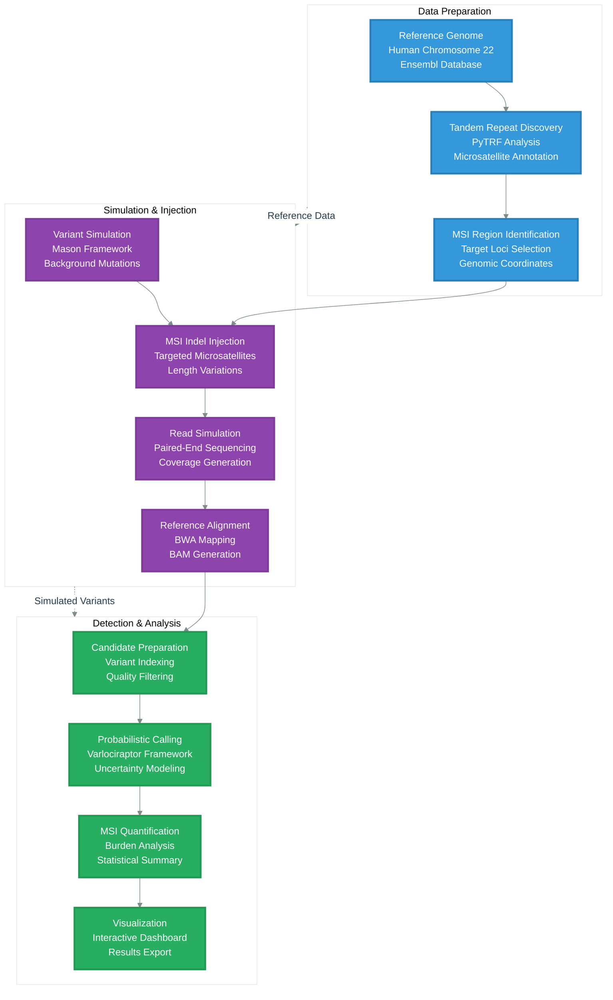

# MSI-Snakemake-Workflow

Snakemake Workflow for Tandem Repeat Finders and Microsatellites

```mermaid
%%{init: {'theme':'base', 'themeVariables': {'primaryColor':'#ffffff', 'primaryTextColor':'#2C3E50', 'primaryBorderColor':'#34495E', 'lineColor':'#7F8C8D'}}}%%
flowchart TD
    subgraph PREP ["Data Preparation"]
        direction TB
        A["Reference Genome<br/>Human Chromosome 22<br/>Ensembl Database"]
        B["Tandem Repeat Discovery<br/>PyTRF Analysis<br/>Microsatellite Annotation"]
        C["MSI Region Identification<br/>Target Loci Selection<br/>Genomic Coordinates"]
        
        A --> B
        B --> C
    end
    
    subgraph SIM ["Simulation & Injection"]
        direction TB
        D["Variant Simulation<br/>Mason Framework<br/>Background Mutations"]
        E["MSI Indel Injection<br/>Targeted Microsatellites<br/>Length Variations"]
        F["Read Simulation<br/>Paired-End Sequencing<br/>Coverage Generation"]
        G["Reference Alignment<br/>BWA Mapping<br/>BAM Generation"]
        
        D --> E
        E --> F
        F --> G
    end
    
    subgraph DETECT ["Detection & Analysis"]
        direction TB
        H["Candidate Preparation<br/>Variant Indexing<br/>Quality Filtering"]
        I["Probabilistic Calling<br/>Varlociraptor Framework<br/>Uncertainty Modeling"]
        J["MSI Quantification<br/>Burden Analysis<br/>Statistical Summary"]
        K["Visualization<br/>Interactive Dashboard<br/>Results Export"]
        
        H --> I
        I --> J
        J --> K
    end
    
    C --> E
    G --> H
    
    classDef prepStyle fill:#3498DB,stroke:#2980B9,stroke-width:3px,color:#FFFFFF
    classDef simStyle fill:#8E44AD,stroke:#7D3C98,stroke-width:3px,color:#FFFFFF
    classDef detectStyle fill:#27AE60,stroke:#229954,stroke-width:3px,color:#FFFFFF
    
    class A,B,C prepStyle
    class D,E,F,G simStyle
    class H,I,J,K detectStyle
    
    PREP -.->|"Reference Data"| SIM
    SIM -.->|"Simulated Variants"| DETECT
```